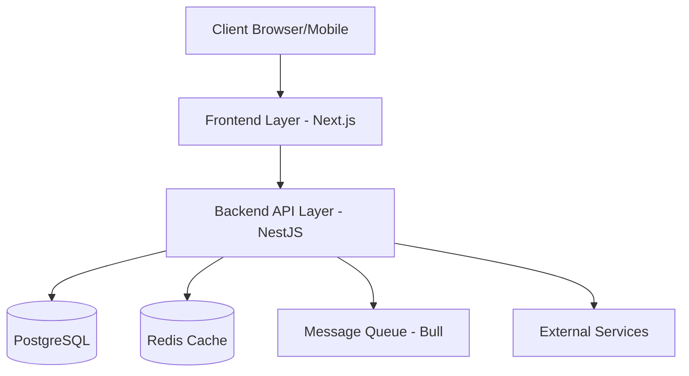

# Design Document - Production Ready App

## Overview

Production Ready App is a scalable SaaS platform built with enterprise-grade architecture, focusing on security, performance, and maintainability. The system follows a microservices-based architecture with clear separation of concerns, utilizing Next.js for the frontend, NestJS for the backend, and PostgreSQL for data persistence.

## Architecture

The system implements a three-tier architecture with additional supporting services:



### System Components

1. **Frontend Layer (Next.js)**
   - Server-side rendered React applications
   - Redux for state management
   - Material-UI component library
   - Real-time WebSocket connections
   - Progressive Web App (PWA) capabilities

2. **Backend Layer (NestJS)**
   - RESTful API endpoints
   - WebSocket gateway for real-time features
   - Modular architecture with domain-driven design
   - JWT-based authentication
   - Role-based access control (RBAC)

3. **Database Layer (PostgreSQL)**
   - Relational database with TypeORM
   - Database migrations
   - Optimized indexes
   - Partitioning for large tables

4. **External Integrations**
   - Google OAuth for authentication
   - AWS S3 for file storage
   - SendGrid for email notifications
   - Stripe for payments
   - Analytics services integration

## Components and Interfaces

### Backend Services

```typescript
// Auth Service
@Injectable()
export class AuthService {
  async validateUser(email: string, password: string): Promise<User>;
  async googleLogin(token: string): Promise<AuthResponse>;
  async generateJWT(user: User): Promise<string>;
}

// Project Service
@Injectable()
export class ProjectService {
  async createProject(dto: CreateProjectDto): Promise<Project>;
  async getProjectAnalytics(projectId: string): Promise<Analytics>;
  async assignUsers(projectId: string, userIds: string[]): Promise<void>;
}

// Task Service
@Injectable()
export class TaskService {
  async createTask(dto: CreateTaskDto): Promise<Task>;
  async updateTaskStatus(taskId: string, status: TaskStatus): Promise<Task>;
  async getTasksByProject(projectId: string): Promise<Task[]>;
}
```

### Frontend Components

```typescript
// Project Dashboard Component
interface DashboardProps {
  projectId: string;
  analytics: Analytics;
  onRefresh: () => void;
}

// Task List Component
interface TaskListProps {
  tasks: Task[];
  onStatusChange: (taskId: string, status: TaskStatus) => void;
  onDelete: (taskId: string) => void;
}

// File Upload Component
interface FileUploadProps {
  projectId: string;
  onUploadComplete: (fileUrl: string) => void;
  allowedTypes: string[];
  maxSize: number;
}
```

## Data Models

### Core Entities

```typescript
@Entity('users')
export class User {
  @PrimaryGeneratedColumn('uuid')
  id: string;

  @Column({ unique: true })
  email: string;

  @Column()
  hashedPassword: string;

  @Column({ enum: UserRole })
  role: UserRole;

  @ManyToMany(() => Project)
  projects: Project[];
}

@Entity('projects')
export class Project {
  @PrimaryGeneratedColumn('uuid')
  id: string;

  @Column()
  name: string;

  @Column()
  description: string;

  @OneToMany(() => Task)
  tasks: Task[];

  @ManyToMany(() => User)
  members: User[];
}

@Entity('tasks')
export class Task {
  @PrimaryGeneratedColumn('uuid')
  id: string;

  @Column()
  title: string;

  @Column()
  description: string;

  @Column({ enum: TaskStatus })
  status: TaskStatus;

  @ManyToOne(() => Project)
  project: Project;

  @ManyToOne(() => User)
  assignee: User;
}
```

## Error Handling

1. **Global Exception Filter**
```typescript
@Catch()
export class GlobalExceptionFilter implements ExceptionFilter {
  catch(exception: any, host: ArgumentsHost) {
    // Handle different types of exceptions
    // Return standardized error responses
  }
}
```

2. **Error Response Format**
```typescript
interface ErrorResponse {
  statusCode: number;
  message: string;
  error: string;
  timestamp: string;
  path: string;
}
```

## Testing Strategy

1. **Unit Tests**
   - Jest for testing individual components
   - Mock external dependencies
   - Coverage threshold: 80%

2. **Integration Tests**
   - Test API endpoints with supertest
   - Database integration tests
   - External service integration tests

3. **E2E Tests**
   - Cypress for frontend testing
   - Complete user flow testing
   - Cross-browser compatibility

4. **Performance Tests**
   - Load testing with Artillery
   - Stress testing for scaling validation
   - Response time benchmarking

This design document provides a foundation for implementing the Production Ready App. The architecture ensures scalability, maintainability, and security while following best practices in modern web development.