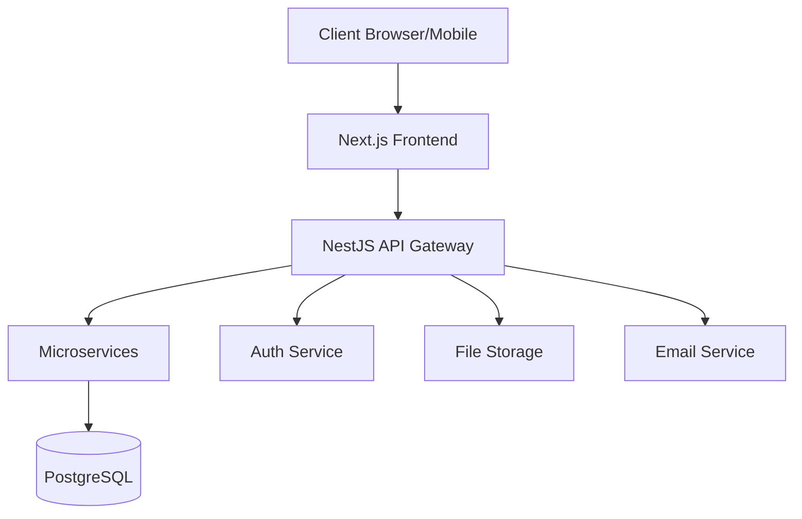

# Design Document - Production Ready App

## Overview

Production Ready App is a scalable SaaS platform built with enterprise-grade architecture, focusing on security, performance, and maintainability. The system follows a microservices-based architecture with clear separation of concerns, utilizing Next.js for the frontend, NestJS for the backend, and PostgreSQL for data persistence.

## Architecture

The system implements a three-tier architecture with additional supporting services:



### System Components

1. **Frontend Layer (Next.js)**
   - Server-side rendered React applications
   - Redux for state management
   - Material-UI component library
   - Real-time WebSocket connections
   - Progressive Web App capabilities

2. **Backend Layer (NestJS)**
   - RESTful API endpoints
   - GraphQL API for complex queries
   - WebSocket gateway for real-time features
   - Microservices architecture
   - JWT-based authentication

3. **Database Layer (PostgreSQL)**
   - Normalized schema design
   - TypeORM for ORM
   - Database migrations
   - Read replicas for scaling

4. **External Integrations**
   - Google OAuth
   - AWS S3 for file storage
   - SendGrid for email notifications
   - Redis for caching
   - Elasticsearch for search

## Components and Interfaces

### Backend Services

```typescript
@Injectable()
export class AuthService {
  async validateUser(email: string, password: string): Promise<User>;
  async createToken(user: User): Promise<AuthToken>;
}

@Injectable()
export class ProjectService {
  async createProject(dto: CreateProjectDto): Promise<Project>;
  async getProjectAnalytics(projectId: string): Promise<Analytics>;
}

@Injectable()
export class TaskService {
  async createTask(dto: CreateTaskDto): Promise<Task>;
  async assignTask(taskId: string, userId: string): Promise<Task>;
}
```

### Frontend Components

```typescript
interface DashboardProps {
  projects: Project[];
  analytics: Analytics;
  onProjectSelect: (projectId: string) => void;
}

interface TaskBoardProps {
  tasks: Task[];
  users: User[];
  onTaskUpdate: (task: Task) => void;
  onTaskAssign: (taskId: string, userId: string) => void;
}
```

## Data Models

### Core Entities

```typescript
@Entity('users')
export class User {
  @PrimaryGeneratedColumn('uuid')
  id: string;

  @Column({ unique: true })
  email: string;

  @Column()
  hashedPassword: string;

  @OneToMany(() => Project, project => project.owner)
  projects: Project[];
}

@Entity('projects')
export class Project {
  @PrimaryGeneratedColumn('uuid')
  id: string;

  @Column()
  name: string;

  @ManyToOne(() => User, user => user.projects)
  owner: User;

  @OneToMany(() => Task, task => task.project)
  tasks: Task[];
}

@Entity('tasks')
export class Task {
  @PrimaryGeneratedColumn('uuid')
  id: string;

  @Column()
  title: string;

  @Column('text')
  description: string;

  @Column('enum', { enum: TaskStatus })
  status: TaskStatus;

  @ManyToOne(() => Project, project => project.tasks)
  project: Project;

  @ManyToOne(() => User)
  assignee: User;
}
```

## Error Handling

1. **Global Exception Filter**
```typescript
@Catch()
export class GlobalExceptionFilter implements ExceptionFilter {
  catch(exception: any, host: ArgumentsHost) {
    const ctx = host.switchToHttp();
    const response = ctx.getResponse();
    const status = exception.getStatus?.() || 500;

    response.status(status).json({
      statusCode: status,
      timestamp: new Date().toISOString(),
      message: exception.message || 'Internal server error',
    });
  }
}
```

2. **Error Types**
```typescript
export class ApplicationError extends Error {
  constructor(
    public readonly code: string,
    message: string,
    public readonly status: number = 400,
  ) {
    super(message);
  }
}
```

## Testing Strategy

1. **Unit Tests**
   - Jest for testing framework
   - Test individual services and components
   - Mock external dependencies

2. **Integration Tests**
   - Test API endpoints
   - Database interactions
   - External service integrations

3. **E2E Tests**
   - Cypress for frontend testing
   - Full user journey testing
   - API contract testing with Pact

```typescript
describe('AuthService', () => {
  let service: AuthService;

  beforeEach(async () => {
    const module = await Test.createTestingModule({
      providers: [AuthService],
    }).compile();

    service = module.get(AuthService);
  });

  it('should validate user credentials', async () => {
    const result = await service.validateUser('test@example.com', 'password');
    expect(result).toBeDefined();
  });
});
```

The design includes additional considerations for:
- Scalability through microservices
- Security with JWT and OAuth
- Performance optimization with caching
- Real-time capabilities with WebSockets
- Comprehensive testing strategy
- Clear error handling patterns
- Type safety with TypeScript
- Database optimization with indexes and constraints