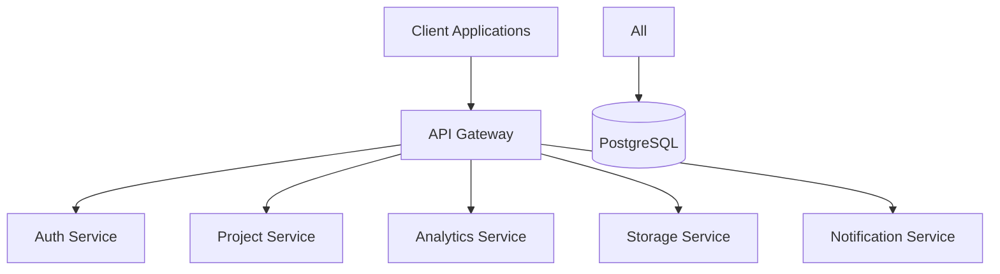

# Design Document - Production Ready App

## Overview

Production Ready App is a scalable SaaS platform built with enterprise-grade architecture, focusing on security, performance, and maintainability. The system follows a microservices-based architecture with clear separation of concerns, implementing domain-driven design principles.

## Architecture

The application follows a three-tier architecture with additional supporting services:



### System Components

1. **Frontend Layer (Next.js)**
   - Server-side rendered React applications
   - Redux for state management
   - Material-UI for component library
   - React Query for data fetching and caching
   - Progressive Web App (PWA) support

2. **Backend Layer (NestJS)**
   - Microservices architecture
   - REST and GraphQL APIs
   - JWT-based authentication
   - Role-based access control (RBAC)
   - WebSocket support for real-time features

3. **Database Layer (PostgreSQL)**
   - Multi-tenant architecture
   - Read replicas for scaling
   - Materialized views for analytics
   - Partitioning for large tables

4. **External Integrations**
   - Google OAuth for authentication
   - AWS S3 for file storage
   - SendGrid for email notifications
   - Redis for caching
   - Elasticsearch for search functionality

## Components and Interfaces

### Backend Services

```typescript
@Injectable()
export class AuthService {
  async validateUser(email: string, password: string): Promise<User>;
  async createUser(createUserDto: CreateUserDto): Promise<User>;
  async generateToken(user: User): Promise<string>;
}

@Injectable()
export class ProjectService {
  async createProject(createProjectDto: CreateProjectDto): Promise<Project>;
  async getProjects(userId: string): Promise<Project[]>;
  async updateProject(id: string, updateProjectDto: UpdateProjectDto): Promise<Project>;
}

@Injectable()
export class AnalyticsService {
  async getDashboardMetrics(userId: string): Promise<DashboardMetrics>;
  async generateReport(reportConfig: ReportConfig): Promise<Report>;
}
```

### Frontend Components

```typescript
interface DashboardProps {
  metrics: DashboardMetrics;
  onRefresh: () => void;
}

interface ProjectListProps {
  projects: Project[];
  onProjectSelect: (projectId: string) => void;
  onProjectCreate: (project: CreateProjectDto) => void;
}

interface FileUploadProps {
  onUpload: (file: File) => Promise<void>;
  allowedTypes: string[];
  maxSize: number;
}
```

## Data Models

### Core Entities

```typescript
@Entity('users')
export class User {
  @PrimaryGeneratedColumn('uuid')
  id: string;

  @Column({ unique: true })
  email: string;

  @Column()
  hashedPassword: string;

  @Column({ type: 'json' })
  roles: string[];

  @OneToMany(() => Project, project => project.owner)
  projects: Project[];
}

@Entity('projects')
export class Project {
  @PrimaryGeneratedColumn('uuid')
  id: string;

  @Column()
  name: string;

  @Column({ type: 'text' })
  description: string;

  @ManyToOne(() => User, user => user.projects)
  owner: User;

  @OneToMany(() => Task, task => task.project)
  tasks: Task[];
}

@Entity('tasks')
export class Task {
  @PrimaryGeneratedColumn('uuid')
  id: string;

  @Column()
  title: string;

  @Column({ type: 'text' })
  description: string;

  @Column({ type: 'enum', enum: TaskStatus })
  status: TaskStatus;

  @ManyToOne(() => Project, project => project.tasks)
  project: Project;
}
```

## Error Handling

- Global exception filter for consistent error responses
- Custom exception classes for domain-specific errors
- HTTP status codes mapping to application errors
- Structured error logging with correlation IDs
- Retry mechanisms for transient failures

```typescript
@Catch()
export class GlobalExceptionFilter implements ExceptionFilter {
  catch(exception: any, host: ArgumentsHost) {
    // Implementation
  }
}
```

## Testing Strategy

1. **Unit Tests**
   - Jest for testing framework
   - Service and component unit tests
   - Mocking external dependencies

2. **Integration Tests**
   - API endpoint testing
   - Database integration tests
   - External service integration tests

3. **E2E Tests**
   - Cypress for frontend E2E testing
   - API E2E testing with supertest
   - Performance testing with k6

```typescript
describe('ProjectService', () => {
  it('should create a project', async () => {
    // Test implementation
  });
});
```

## Security Considerations

- OAuth 2.0 and JWT for authentication
- HTTPS enforcement
- CORS configuration
- Rate limiting
- Input validation
- SQL injection prevention
- XSS protection
- CSRF protection
- Regular security audits

## Performance Optimization

- Redis caching
- Database indexing
- Query optimization
- CDN for static assets
- Image optimization
- Lazy loading
- Code splitting
- Server-side rendering

This design document provides a foundation for implementing the Production Ready App. The architecture is scalable and maintainable, with clear separation of concerns and robust security measures.